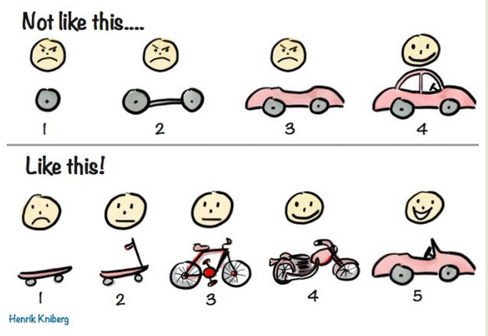

# Snek

## Introduction

Welcome to Snek! We will implement parts of this game:


If you have never seen this game before you can play it here: <http://thecodeplayer.com/walkthrough/html5-game-tutorial-make-a-snake-game-using-html5-canvas-jquery> - the code is very simple but unabashedly imperative (that's the opposite of functional), so it will serve as a useful counter example!

The challenge will be to implement the game in a functional manner. To reiterate, functional means to keep functions as pure as possible, i.e. to have no side-effects in them.

I won't tell you what code to write, but we will break the implementation down into bite-sized mini goals. This will teach you how to build up an implementation from the bottom up, and to slowly evolve it into the final project.

Feel free to use this project to learn a new programming language. Maybe you want to give Python or Ruby a try. Maybe you'd like to see why Max keeps raving about Clojure. Or maybe you just want to learn to program functionally in an environment you're already confident in and you decide to write it in JS/Node. All of these are fine! I will provide some ES6/Node example solutions in the `solutions` folder, but if there is any way at all, try not to look at them!


## Philosophy
By virtue of me writing this, this is also an illustration of *Hoes Does Max Develop Programs?*. I am a strong proponent of evolving working programs, as opposed to starting with *The Grand Plan* and then implementing little disconnected pieces that will all work together perfectly once everything is in place. In my experience that never happens, requirements change under you, and a critical piece of the *Grand Plan* simply doesn't work as you expected. Evolving programs will not leave you in a pickle like that and feels a lot more satisfying as well, because you always have *something* that works.

This cartoon summarizes this well:


If you are interested in reading more about this approach, have a look at this article:
- <https://levelup.gitconnected.com/code-less-think-more-incrementally-98adee22df9b>

## Requirements

To get started, install a Java runtime. On MacOS you can do this by installing [homebrew](https://brew.sh/) and running `brew cask install java8 `

Then download the canvas we will draw on. Download it here: <https://s3.amazonaws.com/max.public/GameOfLifeUIServer.jar>

This was originally used to implement the Game of Life but it perfectly suited for any type of pixel-based cross-platform representation. You can start it by double-clicking the `GameOfLifeUIServer.jar` file. It will then open a pink window. If MacOS complains, you may have to open the `Security & Privacy` settings in your `System Preferences` and specifically allow the app to start - that is the *Open Anyway* button right on the first tab!


## GameOfLifeUIServer usage
The GameOfLifeUIServer exposes a REST api on `http://localhost:5000`. It only supports one command: A `POST` to `/`. This post sets one or more pixels at specific coordinates to a certain colour. A pixel is defined as a JSON object with the values `x`,`y`, and `color`. X and Y are integers (0/0 is the upper left corner), and `color` is a CSS hex color string such as `#ff0000`. The `POST` expects a JSON object with the key `cells` that has the value of an array of pixel objects. By default the grid displayed has 25x25 pixels.

This may sound a little hard, but it's easy when you try it. Start the UI Server and run this in a console:

```sh
 curl -H "Content-Type: application/json" -X POST -d '{"cells":[{"x":3,"y":0,"color":"#ff0000"}]}' http://localhost:5000/
```

This should turn the 4th pixel in the first row red! Once this works, head on to the challenges

## Functional Programming Guidelines
Try to follow these guidelines for your application:

- Keep the core functions - especially those involving business logic - pure

- Push state manipulations to the very boundaries of your application

- Your main functions should simply pipe data through your pure functions

- Keep your functions short


# Challenges

## Challenge 1 - Displaying Pixels

In the first challenge, we will set the foundation for being able to display anything at all! We will start with just placing a few pixels, and then draw things with a background!

- Write a program that does the same thing as the `curl` call from the *GameOfliveUIServer usage* section. Feel free to use a different colour or position!

If you're doing this on NodeJS, I have good experience with the [request module](https://github.com/request/request). Make sure not to post this as form encoded and to send the right content-type!

- Now refactor your program into a function that takes any number of pixels and displays them. A pixel is a JSON structure with an `x`, a `y` and a `color`, like this: `{"x":3,"y":0,"color":"#ff0000"}`. Extra brownie points if you make it easy to just pass a single pixel as well.

- Write a function that takes a number of pixels, and a background colour, and returns a full grid of pixels of the specified background color, plus the initially specified pixels.
As an example, calling something like `makeRequest(fillBackground("#ffffff", [{x:0,y:0,"#ff0000"}]))` should fill the whole grid with white pixels and only the top-left most pixel should be red.

> **Note**: Please note that in my hypothetical `fillBackground` function we give the background colour first, and the arguments that change more often last. This is by design and a typical pattern in functional programming; it allows me to create a convenience function through partial application, such as
```
const fillWhiteBackground = partial(fillBackground, ["#ffffff"])
fillWhiteBackground([{x:0,y:0,color:"#ff0000"}])
```
> to make my code more expressive and to save me from having to specify the white background colour in multiple places. Try to follow this pattern wherever you can!

> Please also note that we are not creating side-effects in the `fillBackground` function, but we are instead manipulating data structures! This is the essence of functional programming!

## Challenge 2 - Refactoring the Data Structure
If you have completed challenge 1 the same way that I have, you have been manipulating lists of pixels. If you look at my [solution to challenge 1](solutions/challenge1.js) you see how awkward this is getting when comparing and manipulating pixels. There is a better way, but it requires some refactoring: we will move to a different representation of the grid, from a pure list of pixels to a hashmap that allows us to address pixels by their `x` and `y` coordinates. The resulting structure will look like this:

```js
{
"0 0": {"x": 0, "y": 0, "color": "#ff0000"},
"1 0": {"x": 0, "y": 0, "color": "#ffffff"},
....
}
```

If your language doesn't require keys to be strings, all the better! You can use arrays with numbers in them and save yourself some string back-and-forth!

Even so, some things are still easier expressed as lists, and the request needs to be populated with a list as well. This leads us to the first subchallenge:

- create two functions `toGridmap`, which takes a list of pixels and returns a Gridmap as described above, and a `fromGridmap` function that does the same in reverse.

These functions are important and I would like to make you familiarize yourself (if you haven't yet) with another concept: testing.

For nodeJS we recommend *Mocha* and *Chai* as the test-runner and assertion libraries; here is an
[introductory guide](http://mherman.org/blog/2015/09/10/testing-node-js-with-mocha-and-chai/). Once you have installed either this, or a testing library of your choice:

- Write a few simple tests for the `toGridmap` and `fromGridmap` functions

Lastly, we need to rewrite parts of our code to use the new functionality! You should start to see the first payoffs of the improved grid representation!

- Change your code to use the `toGridmap` and `fromGridmap` functions. Feel free to write more tests to make sure that your functions still work!

> **Note**: Functional programming is all about manipulating data. You can make your life significantly easier if you choose a good data representation of your domain!


## Challenge 3 - Moving the Pixel

In this challenge we are starting to move our initial pixel around!

You can use whatever keys you like, but I will assume the arrow keys on the keyboard. Your tasks are:

- Create a function that moves a pixel left, right, up or down, depending on its input

Please remember the separation between manipulating a data structure, and displaying a data structure! Keep the side effects at the edges of your application!

- Write a function that reads a key and returns its value

For nodeJS, take a look at
[this stackoverflow question](https://stackoverflow.com/questions/5006821/nodejs-how-to-read-keystrokes-from-stdin) for some guidance. Also remember that this is an asynchronous operation in JS, and you will need to pass callbacks. In Python, it is the `raw_input()` function for Python2, and just `input()` for Python3. For everything else, you'll figure it out :)


- Combine the two functions to move the pixel left, right, up and down, depening on the arrow key input

Don't worry about timing or anything, just change the pixel according the the input, whenever it happens. Please keep in mind to do this functionally, i.e. don't change data structures, but instead build up new ones!


## Challenge 4 - Building the Snake

In this challenge we are making our snake look like a snake! We will start by defining the initial snake as 3 elements and hardcode the starting position. Then we will move the snake around instead of just a single pixel.

Here is a thought that may help you wrap your head around how to move the snake:

> To move the snake it is enough to create a new **head** pixel and drop the **tail** pixel.

If you do this, it will look like the snake is moving!

Also, by now our 'step-by-step' approach has probably resulted in a pretty cluttered solution. By
now you probably understand the problem a lot better and you can go ahead and refactor your solution and clean it up a little. Don't forget to write a few tests so you don't accidentally break any functionality while refactoring!

> **Note:** The understanding of the problem space you have gained is, in my opinion, one of the greatest benefits of an iterative approach to development.
