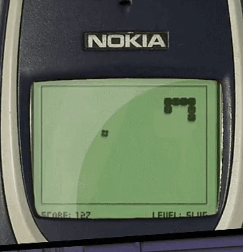

# Snek

## Introduction

Welcome to Snek! We will implement parts of this game:



The challenge will be to implement the game in a functional manner. To reiterate, functional means to keep functions as pure as possible, i.e. to have no side-effects in them.

I won't tell you what code to write, but we will break the implementation down into bite-sized mini goals. This will teach you how to build up an implementation from the bottom up, and to slowly evolve it into the final project.

Feel free to use this project to learn a new programming language. Maybe you want to give Python or Ruby a try. Maybe you'd like to see whyMax keeps raving about Clojure. Or maybe you just want to learn to program functionally in an environment you're already confident in and you decide to write it in JS/Node. All of these are fine! I will provide some ES6/Node example solutions in the `solutions` folder, but if there is any way at all, try not to look at them!

## Requirements
To get started, install a Java runtime. On MacOS you can do this through:

```sh
brew cask install java
```

assuming you have [HomeBrew](https://brew.sh/ "HomeBrew") installed.

Then download the canvas we will draw to: <https://s3.amazonaws.com/max.public/GameOfLifeUIServer.jar>

This was originally used to implement the Game of Life but it perfectly suited for any type of pixel-based cross-platform representation.
You can start it by double-clicking the `GameOfLifeUIServer.jar` file. It will then open a window.

## GameOfLifeUIServer usage
The GameOfLifeUIServer exposes a REST api on `http://localhost:5000`. It only supports one command: A `POST` to `/`. This post sets one or more pixels at specific coordinates to a certain colour. A pixel is defined as a JSON object with the values `x`,`y`, and `color`. X and Y are integers (0/0 is the upper left corner), and `color` is a CSS hex color string such as `#ff0000`. The `POST` expects a JSON object with the key `cells` that has the value of an array of pixel objects.

This may sound a little hard, but it's easy when you try it. Start the UI Server and run this in a console:

```sh
 curl -H "Content-Type: application/json" -X POST -d '{"cells":[{"x":3,"y":0,"color":"#ff0000"}]}' http://localhost:5000/
```

This should turn the 4th pixel in the first row red! Once this works, head on to the challenges

# Challenges

## Challenge 1

- Write a program that does the same thing as the `curl` call from the *GameOfliveUIServer usage* section. Feel free to use a different colour or position!

If you're doing this on NodeJS, I have good experience with the [request module](https://github.com/request/request). Make sure not to post this as form encoded and to send the right content-type!

- Now refactor this

-
